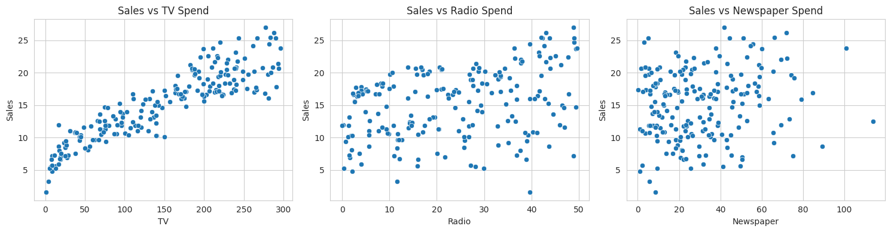
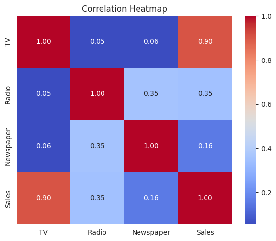
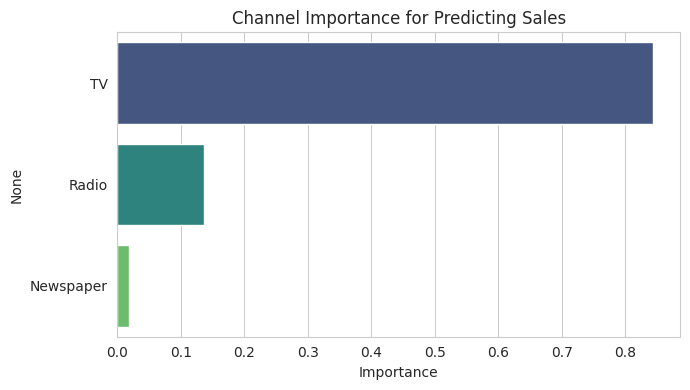
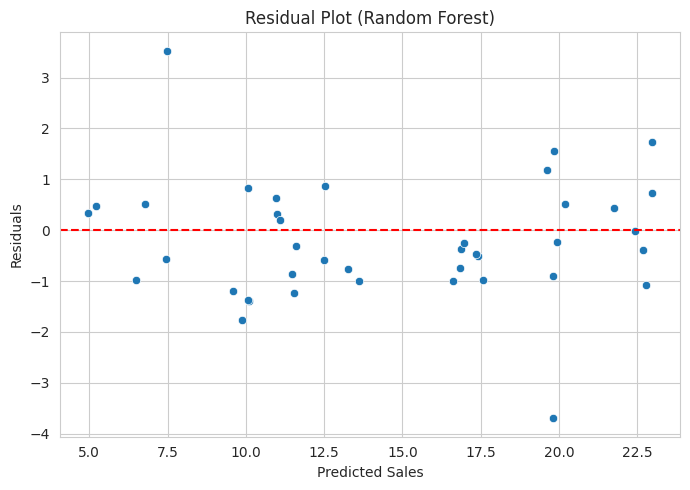

# Sales Prediction using Python

## About
This project was completed as part of my Data Science internship at CodeAlpha.

## Problem Statement
Predict product sales based on advertising spend across TV, Radio, and Newspaper channels, and identify which channels drive the most impact.

## Dataset
200 records with advertising spend (in thousands) across TV, Radio, and Newspaper, and resulting Sales figures. No missing values.

## Approach
- Data loading and exploration
- EDA: scatter plots of Sales vs each channel, correlation heatmap
- Train/test split
- Trained and compared Linear Regression and Random Forest Regressor
- Evaluated with R², MAE, and RMSE
- Analyzed channel importance and residuals

## Results
- Linear Regression: R² = 0.9059, MAE = 1.27, RMSE = 1.71
- **Random Forest: R² = 0.9547, MAE = 0.91, RMSE = 1.18 (best model)**
- Linear Regression coefficients: TV = 0.0545, Radio = 0.1009, **Newspaper = 0.0043 (negligible impact)**

## Business Insight
TV and Radio advertising show a strong, clear relationship with sales. Newspaper spend contributes almost nothing to predicting sales in this dataset — businesses could likely improve ROI by reallocating that budget toward TV and Radio instead.

## Tools Used
Python, pandas, scikit-learn, matplotlib, seaborn

## How to Run
1. Clone this repo
2. Install requirements: `pip install -r requirements.txt`
3. Open `notebook/sales_prediction.ipynb` in Jupyter or Google Colab
4. Run all cells

## Video Explanation
[Add your LinkedIn video link here after posting]
